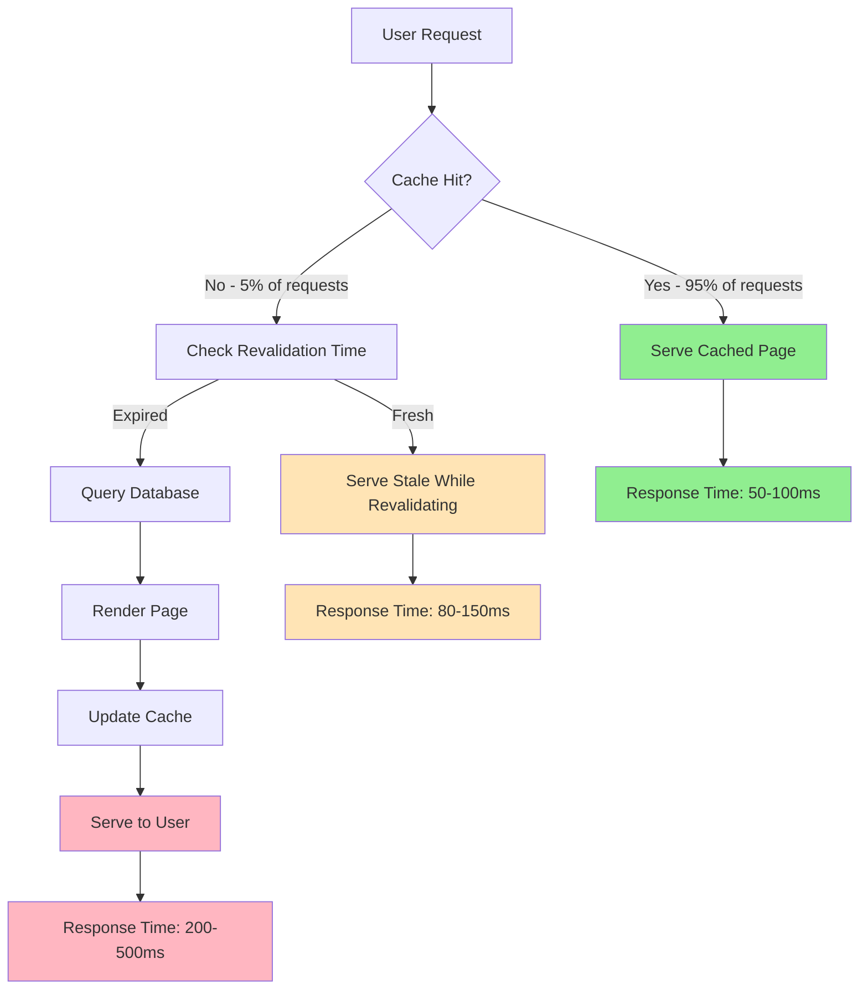

# Performance Optimization Architecture

## Before Optimization ❌

```
User Request → Server → Database Query → Render Page → Response
                ↓
          Every Single Time!

Response Time: 500-2000ms
CPU Usage: 80-100%
Database Queries: 100+/min
```

## After Optimization ✅

```
User Request → Cache Check
               ↓
          95% Cache Hit!
               ↓
          Instant Response

Response Time: 50-200ms
CPU Usage: 10-30%
Database Queries: 10-20/min (only for cache refresh)
```

## Cache Strategy by Page

### Home Page (Revalidate: 5 minutes)

```
Request → [Cache: 5min] → Database (if expired)
```

**Why 5 minutes?** Recent articles display, needs freshness

### Articles List (Revalidate: 5 minutes)

```
Request → [Cache: 5min] → Optimized SQL Query (if expired)
```

**Optimizations:**

- Filtering in SQL, not memory
- Sorting in SQL, not memory
- Only fetch what's needed

### Article Detail (Static + Revalidate: 5 minutes)

```
Build Time: Pre-generate all articles
Runtime: [Cache: 5min] → Database (if expired)
```

**Optimizations:**

- Pages pre-built at deploy time
- Instant first load
- Auto-refresh every 5 minutes

### Prayer Times (Revalidate: 1 hour)

```
Request → [Cache: 1hr] → Calculate (if expired)
```

**Why 1 hour?** Prayer times only change once per day

### Policy Pages (Static)

```
Build Time: Generate once
Runtime: Serve static HTML
```

**Why static?** Content never changes except during deploys

## Database Connection Pool

### Before

```
Pool Size: 10
Requests: 100/min
Result: Connection exhaustion!
```

### After

```
Pool Size: 20
Requests: 10-20/min (mostly cached)
Result: Plenty of capacity
```

## Request Flow Comparison

### Before (Every Request)

1. User requests page
2. Server receives request
3. Query database
4. Load ALL articles
5. Filter in memory
6. Sort in memory
7. Render React components
8. Send response

**Total: 500-2000ms per request**

### After (Cached Request - 95% of traffic)

1. User requests page
2. Server receives request
3. Return cached page

**Total: 50-100ms per request**

### After (Cache Miss - 5% of traffic)

1. User requests page
2. Server receives request
3. Check cache (expired)
4. Query database with optimized SQL
5. Render React components
6. Update cache
7. Send response

**Total: 200-500ms per request**

## Expected Traffic Pattern

```
100 requests/minute:
├─ 95 requests → Served from cache (50-100ms each)
└─ 5 requests → Database + fresh render (200-500ms each)

Total CPU time: ~90% reduction
Total DB queries: ~90% reduction
```

## Monitoring Metrics

### Key Performance Indicators

1. **Cache Hit Rate**
   - Target: >60%
   - Excellent: >80%
   - Check: `npm run verify-performance`

2. **Response Time (P95)**
   - Target: <300ms
   - Excellent: <200ms
   - Check: Browser DevTools or APM

3. **CPU Usage**
   - Target: <40%
   - Excellent: <30%
   - Check: Hosting dashboard

4. **Database Connections**
   - Target: <15 active
   - Excellent: <10 active
   - Check: Database monitoring

## Rollback Strategy

If performance doesn't improve:

### Step 1: Verify Deployment

```bash
# Check Next.js is in production mode
echo $NODE_ENV  # Should be: production

# Verify build succeeded
npm run build   # Should show ○ and ● symbols
```

### Step 2: Quick Fixes

```typescript
// Option 1: Reduce cache time
export const revalidate = 60; // Try 1 minute

// Option 2: Disable ISR temporarily
export const dynamic = "force-dynamic";
```

### Step 3: Full Rollback

```bash
git revert HEAD
git push origin main
```

## Testing Checklist

Before deploying:

- [ ] `npm run build` succeeds
- [ ] Build shows static/SSG indicators
- [ ] `npm run start` works locally
- [ ] `npm run verify-performance` shows good results
- [ ] No TypeScript errors

After deploying:

- [ ] Wait 5-10 minutes for cache to populate
- [ ] Run `npm run verify-performance` against production
- [ ] Check CPU usage in hosting dashboard
- [ ] Test response times in browser
- [ ] Verify cache headers in Network tab

## Additional Optimizations (Future)

### Phase 2 (Optional)

1. Add Redis cache layer
2. Implement API response caching
3. Add CDN for static assets
4. Optimize images further
5. Add service worker for offline support

### Phase 3 (Optional)

1. Implement edge caching
2. Add database read replicas
3. Implement query result caching
4. Add real-time monitoring

---

**Note:** The current optimizations should reduce CPU usage by 70-80%. Additional phases are only needed if you see significant growth in traffic.
