# Al-Salam Database - Entity Relationship Diagram

## Overview

This ERD visualizes the complete database schema for the Al-Salam organization system, including user management, memberships, education system, and financial tracking.

## Entity Relationship Diagram

```mermaid
erDiagram
    %% Core User System
    users ||--o{ user_roles : has
    users ||--o{ auth_tokens : has
    users ||--o{ memberships : has
    users ||--o{ student_guardians : "is guardian"
    users ||--o{ articles : "authors"
    users ||--o{ teachers : "is teacher"
    users ||--o{ incoming : "makes payment"
    users ||--o{ purchases : "makes purchase"
    users ||--o{ payments : "makes payment"

    %% Lookup References for Users
    users }o--|| genders : references
    users }o--|| marital_statuses : references

    %% Roles and Permissions (RBAC)
    user_roles }o--|| roles : references
    roles ||--o{ role_permissions : has
    role_permissions }o--|| permissions : has

    %% Memberships
    memberships }o--|| membership_types : "has type"
    memberships }o--|| membership_statuses : "has status"
    memberships ||--o{ payments : "receives"
    memberships ||--o{ incoming : "generates"

    %% Students and Guardians
    students ||--o{ student_guardians : "has guardian"
    students ||--o{ class_students : "enrolls in"
    students ||--o{ attendance : "attends"
    students }o--|| genders : references

    student_guardians }o--|| relationship_types : "relationship type"

    %% Education System
    teachers ||--o{ classes : teaches
    classes }o--|| education_years : "belongs to"
    classes }o--|| education_levels : "at level"
    classes ||--o{ class_schedules : "has schedule"
    classes ||--o{ class_students : "has students"
    classes ||--o{ attendance : "tracks"

    class_schedules }o--|| schedule_days : "on day"
    class_students }o--|| enrollment_statuses : "has status"
    attendance }o--|| attendance_statuses : "has status"

    %% Financial System
    incoming }o--|| incoming_types : "type of"
    incoming }o--|| payment_methods : "paid by"

    purchases }o--|| purchase_categories : "category"
    purchases }o--|| payment_methods : "paid by"

    payments }o--|| payment_methods : "paid by"
    payments }o--|| payment_statuses : "has status"

    %% Entity Definitions

    users {
        int id PK
        varchar email UK
        varchar first_name
        varchar last_name
        date birth_date
        int gender_id FK
        varchar phone
        text address
        int marital_status_id FK
        boolean is_active
        timestamp last_connection_at
        timestamp created_at
        timestamp updated_at
        timestamp deleted_at
    }

    roles {
        int id PK
        varchar code UK
        varchar name_de
        varchar name_ar
        varchar name_fr
        text description
        boolean is_system_role
        boolean is_active
    }

    permissions {
        int id PK
        varchar code UK
        varchar name
        text description
        varchar resource
        varchar action
        boolean is_active
    }

    user_roles {
        int id PK
        int user_id FK
        varchar role_code FK
        timestamp granted_at
        int granted_by_user_id FK
        timestamp expires_at
        boolean is_active
    }

    role_permissions {
        varchar role_code FK
        int permission_id FK
    }

    auth_tokens {
        int id PK
        int user_id FK
        varchar token UK
        varchar token_type
        timestamp expires_at
        timestamp used_at
    }

    memberships {
        int id PK
        varchar membership_id UK
        int user_id FK
        int membership_type_id FK
        int status_id FK
        date start_date
        date end_date
        decimal annual_fee
        text notes
        varchar sepa_account_holder
        varchar sepa_iban
        varchar sepa_bic
        varchar sepa_bank
        boolean sepa_mandate_accepted
        varchar confirmation_token UK
        timestamp confirmed_at
        timestamp created_at
        timestamp updated_at
        timestamp deleted_at
    }

    students {
        int id PK
        varchar first_name
        varchar last_name
        date birth_date
        int gender_id FK
        varchar emergency_contact
        varchar emergency_phone
        text medical_info
        text notes
        timestamp created_at
        timestamp updated_at
        timestamp deleted_at
    }

    student_guardians {
        int id PK
        int student_id FK
        int user_id FK
        int relationship_type_id FK
        boolean is_primary
        boolean can_pickup
        timestamp created_at
    }

    teachers {
        int id PK
        int user_id FK
        varchar specialization
        text qualifications
        text bio
        boolean is_active
        timestamp created_at
        timestamp updated_at
    }

    classes {
        int id PK
        varchar name
        int teacher_id FK
        int education_year_id FK
        int education_level_id FK
        varchar room
        int max_students
        boolean is_active
        timestamp created_at
        timestamp updated_at
    }

    class_schedules {
        int id PK
        int class_id FK
        int schedule_day_id FK
        time start_time
        time end_time
    }

    class_students {
        int id PK
        int class_id FK
        int student_id FK
        int enrollment_status_id FK
        date enrollment_date
        date completion_date
        text notes
        timestamp created_at
    }

    attendance {
        int id PK
        int class_id FK
        int student_id FK
        date attendance_date
        int attendance_status_id FK
        text notes
        timestamp created_at
        timestamp updated_at
    }

    articles {
        int id PK
        text title_de
        text title_ar
        text title_fr
        text content_de
        text content_ar
        text content_fr
        int author_id FK
        timestamp published_at
        boolean is_published
        int created_by_user_id FK
        int updated_by_user_id FK
        timestamp created_at
        timestamp updated_at
    }

    incoming {
        int id PK
        int incoming_type_id FK
        int payment_method_id FK
        int user_id FK
        int membership_id FK
        decimal amount
        varchar currency
        text description
        varchar transaction_reference
        varchar receipt_number
        date received_date
        text notes
        timestamp created_at
        timestamp updated_at
    }

    purchases {
        int id PK
        int purchase_category_id FK
        int payment_method_id FK
        int purchased_by_user_id FK
        text description
        decimal amount
        varchar currency
        varchar invoice_number
        date invoice_date
        varchar vendor_name
        text notes
        timestamp created_at
        timestamp updated_at
    }

    payments {
        int id PK
        int user_id FK
        int membership_id FK
        int payment_method_id FK
        int payment_status_id FK
        decimal amount
        varchar currency
        text description
        varchar transaction_reference
        date payment_date
        timestamp created_at
        timestamp updated_at
    }

    %% Lookup Tables
    genders {
        int id PK
        varchar code UK
        varchar label_de
        varchar label_ar
        varchar label_fr
        boolean is_active
    }

    marital_statuses {
        int id PK
        varchar code UK
        varchar label_de
        varchar label_ar
        varchar label_fr
        boolean is_active
    }

    membership_types {
        int id PK
        varchar code UK
        varchar name
        text description
        decimal default_annual_fee
        boolean is_active
    }

    membership_statuses {
        int id PK
        varchar code UK
        varchar label_de
        varchar label_ar
        varchar label_fr
        boolean is_active
    }

    relationship_types {
        int id PK
        varchar code UK
        varchar label_de
        varchar label_ar
        varchar label_fr
        boolean is_active
    }

    payment_methods {
        int id PK
        varchar code UK
        varchar name
        varchar type
        boolean is_active
    }

    payment_statuses {
        int id PK
        varchar code UK
        varchar label_de
        varchar label_ar
        varchar label_fr
        boolean is_active
    }

    schedule_days {
        int id PK
        varchar code UK
        int day_number
        varchar label_de
        varchar label_ar
        varchar label_fr
        boolean is_active
    }

    education_years {
        int id PK
        varchar year_label UK
        date start_date
        date end_date
        boolean is_current
    }

    education_levels {
        int id PK
        varchar code UK
        varchar label_de
        varchar label_ar
        varchar label_fr
        text description
        int sort_order
        boolean is_active
    }

    enrollment_statuses {
        int id PK
        varchar code UK
        varchar label_de
        varchar label_ar
        varchar label_fr
        boolean is_active
    }

    attendance_statuses {
        int id PK
        varchar code UK
        varchar label_de
        varchar label_ar
        varchar label_fr
        boolean is_active
    }

    incoming_types {
        int id PK
        varchar code UK
        varchar label_de
        varchar label_ar
        varchar label_fr
        boolean is_active
    }

    purchase_categories {
        int id PK
        varchar code UK
        varchar label_de
        varchar label_ar
        varchar label_fr
        boolean is_active
    }
```

## Database Schema Sections

### 1. **Core User Management**

- **users**: Central authentication and user profile table
- **roles**: Role definitions (admin, board_member, treasurer, teacher, member, parent, student)
- **permissions**: Granular permissions for resources and actions
- **user_roles**: Links users to their roles
- **role_permissions**: Links roles to their permissions
- **auth_tokens**: Passwordless authentication tokens (magic links)

### 2. **Membership System**

- **memberships**: Member registrations linked to users
- **membership_types**: Types of memberships (individual, family, student, senior, honorary)
- **membership_statuses**: Status tracking (pending, approved, active, inactive, cancelled)

### 3. **Student & Guardian System**

- **students**: Student records
- **student_guardians**: Many-to-many relationship between students and guardian users
- **relationship_types**: Type of guardian relationship (mother, father, guardian, other)

### 4. **Education System**

- **teachers**: Teacher profiles linked to users
- **classes**: Education classes
- **class_schedules**: Weekly schedule for each class
- **class_students**: Student enrollment in classes
- **attendance**: Daily attendance tracking
- **education_years**: Academic years
- **education_levels**: Course levels (preparatory, level1-4)
- **enrollment_statuses**: Enrollment state (enrolled, waitlist, withdrawn, completed)
- **attendance_statuses**: Attendance states (present, absent, excused, late)

### 5. **Financial System**

- **incoming**: Revenue tracking (donations, fees, etc.)
- **purchases**: Expense tracking
- **payments**: General payment transactions
- **incoming_types**: Categories of income
- **purchase_categories**: Categories of expenses
- **payment_methods**: Payment methods (SEPA, bank transfer, cash, card)
- **payment_statuses**: Payment states (pending, completed, failed, refunded)

### 6. **Content Management**

- **articles**: Multilingual news and announcements (Arabic, German, French)

### 7. **Lookup Tables**

All lookup tables support multilingual labels (German, Arabic, French) for:

- Genders
- Marital statuses
- Days of the week
- Various status codes

## Key Relationships

1. **Users as Central Entity**: The `users` table serves as the central authentication entity, with other entities linking to it
2. **RBAC (Role-Based Access Control)**: Users → User_Roles → Roles → Role_Permissions → Permissions
3. **Student-Guardian**: Many-to-many relationship through `student_guardians` junction table
4. **Class Enrollment**: Students enroll in classes through `class_students`
5. **Financial Tracking**: Three separate tables for income, expenses, and payments, all linked to users and/or memberships
6. **Multilingual Support**: All lookup tables and content support German (de), Arabic (ar), and French (fr)

## Database Views

The schema includes several useful views:

- `vw_user_roles`: User roles with details
- `vw_active_memberships`: Active membership overview
- `vw_students_with_guardians`: Students with their guardian information
- `vw_classes_with_details`: Classes with teacher and enrollment counts
- `vw_student_enrollments`: Student enrollment details
- `vw_attendance_summary`: Attendance statistics
- `vw_monthly_financial_overview`: Monthly income vs expenses
- `vw_incoming_summary`: Income breakdown by type
- `vw_purchase_summary`: Expense breakdown by category
- `vw_membership_payments`: Membership payment tracking

## Notes

- All timestamp fields use `CURRENT_TIMESTAMP` defaults
- Soft deletes are implemented via `deleted_at` timestamp fields
- Foreign key constraints use `ON DELETE CASCADE` where appropriate
- Indexes are created on all foreign keys and frequently queried fields
- Update triggers automatically maintain `updated_at` timestamps
